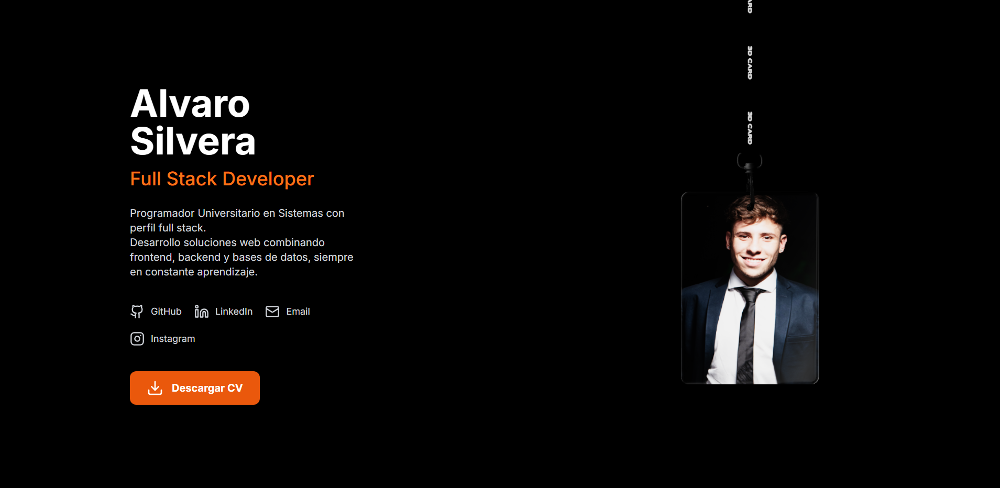

# Portafolio Personal - Alvaro Silvera

Una tarjeta 3D interactiva con física realista que presenta mi perfil profesional como Full Stack Developer. El proyecto combina React Three Fiber, Rapier y Next.js para crear una experiencia visual única.

  

## Características principales

- Tarjeta 3D colgada con cuerda elástica y física realista
- Interacción: arrastrar y soltar la tarjeta con el mouse
- Frente: foto personal | Dorso: diseño inspirado en carta coleccionable Yu-Gi-Oh!
- Información personal clara y descargable (CV)
- Diseño responsive (móvil y escritorio)
- Fondo oscuro moderno con iluminación ambiental

## Tecnologías utilizadas

- **Next.js** 13+ (App Router)
- **React Three Fiber** + **Three.js** (renderizado 3D)
- **@react-three/rapier** (motor de física)
- **Drei** (helpers para Three.js)
- **Tailwind CSS** (estilos)
- **Lucide React** (iconos)
- TypeScript (tipado parcial)

## Cómo ejecutar el proyecto

### Requisitos

- Node.js ≥ 18

### Instalación

```bash
# 1. Clonar el repositorio
git clone https://github.com/alvarotsilvera07/tu-portfolio.git
cd tu-portfolio

# 2. Instalar dependencias
npm install

# 3. Iniciar el servidor de desarrollo
npm run dev